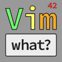
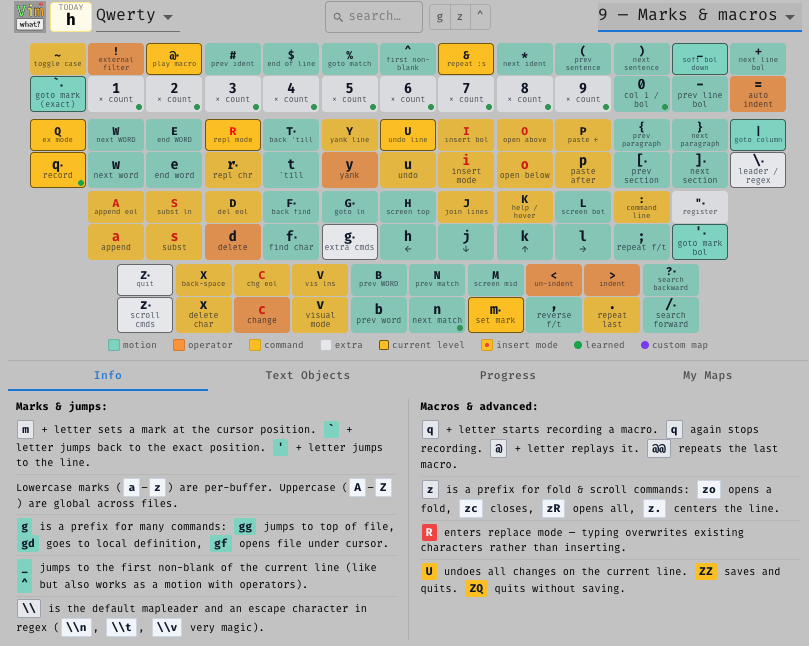

# Vim What?



A Chrome extension for learning Vim commands interactively. Visual keyboard with color-coded keys, prefix mode overlays, progressive lesson levels, and progress tracking.

**[Install on the Chrome Web Store](https://chromewebstore.google.com/detail/vim-what/ngbehgnlcdjkbnihgpkgdangbhemidge)** · **[vimwhat.com](https://vimwhat.com/)**



## Features

- **Visual keyboard** — color-coded key types (motion, operator, command, extra) across 5 layouts: Qwerty, Colemak, Colemak-DH, Dvorak, Workman
- **Dual-layer keyboard** — shifted and unshifted commands are stacked together; no toggle needed
- **Prefix overlays** — toggle `g`, `z`, or `Ctrl` mode to see what each prefix does to every key
- **9 progressive lesson levels** — learn Vim incrementally; current-level keys are outlined, prior keys muted, inactive keys faded
- **Search** — filter keys by name or description
- **Key of the Day** — a daily key to focus on
- **Progress tracking** — mark keys as learned; a green dot appears on learned keys
- **Text Objects reference** — quick reference panel for `i`/`a` text objects
- **Custom mappings** — save personal notes or remaps per key, stored in localStorage
- **Keyboard navigation** — press any key to select it; Escape to clear

## Key Color Guide

| Color | Type | Meaning |
|-------|------|---------|
| Teal | Motion | Moves the cursor |
| Orange | Operator | Acts on a motion (e.g. `d`, `y`, `c`) |
| Yellow | Command | Direct action (e.g. `i`, `o`, `p`) |
| Gray | Extra | Prefix or special commands |

Red key labels enter Insert mode.

## Development

```bash
cd vim-what-react
npm install
npm start        # dev server on localhost:3000
npm test         # run tests
npm run build    # production build (Chrome extension compatible)
```

## Chrome Extension

Install directly from the [Chrome Web Store](https://chromewebstore.google.com/detail/vim-what/ngbehgnlcdjkbnihgpkgdangbhemidge), or load the `build/` folder as an unpacked extension for local development. The build is configured with `INLINE_RUNTIME_CHUNK=false` for Manifest V3 compatibility.
